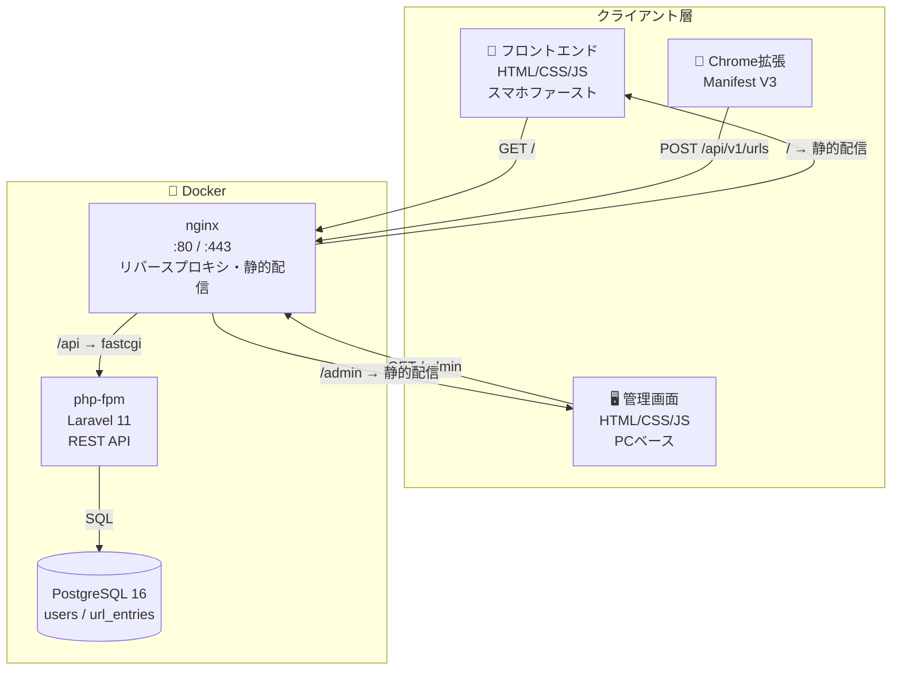
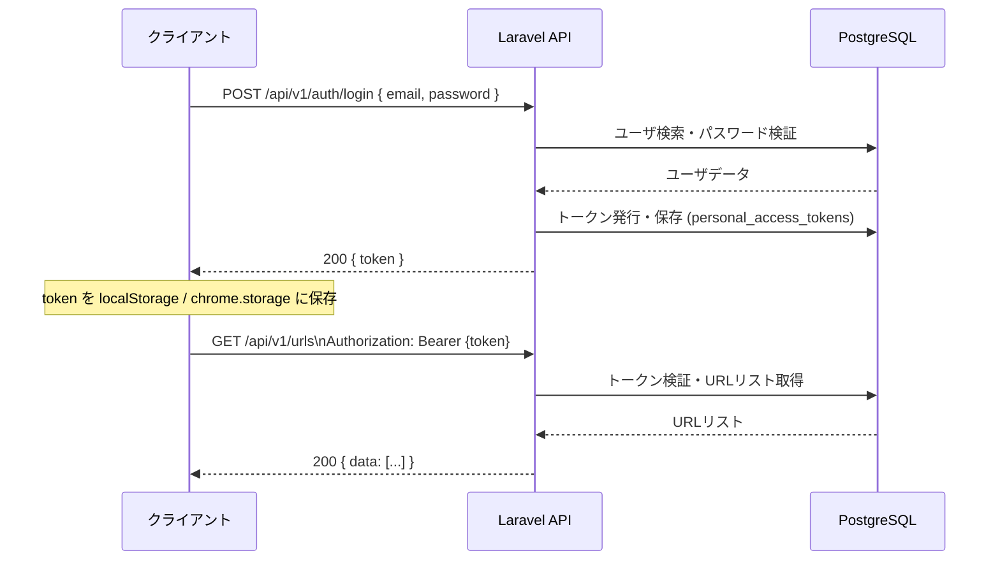
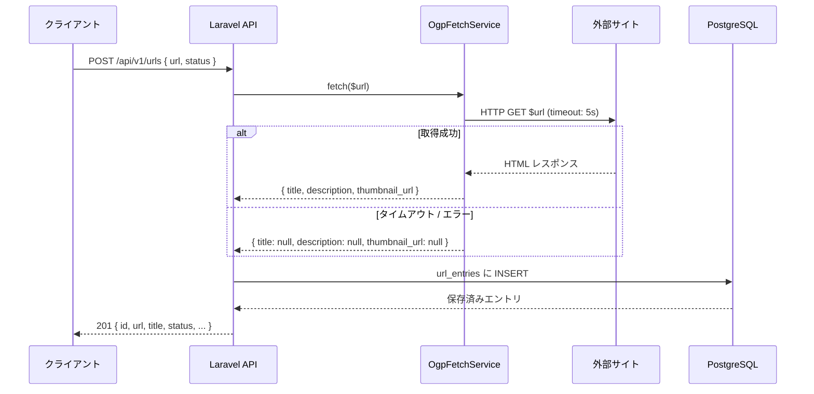

# URL共有ツール アーキテクチャ設計書

## 1. システム構成概要



---

## 2. 技術スタック

| レイヤー | 技術 | 備考 |
|---|---|---|
| インフラ | Docker / Docker Compose | 全サービスをコンテナで管理 |
| Web サーバ | nginx (Docker) | 静的配信 + fastcgi プロキシ |
| バックエンド | PHP 8.x-fpm (Docker) + Laravel 11.x | REST API サーバ |
| フロントエンド | HTML / CSS / JS | スマホファースト、青系モダンデザイン |
| 管理画面 | HTML / CSS / JS | PCベース |
| データベース | PostgreSQL 16 (Docker) | データは volume で永続化 |
| 認証 | Laravel Sanctum | API トークン認証 |
| ブラウザ拡張 | Chrome Extension (Manifest V3) | Fetch API で Laravel API を呼び出す |

---

## 3. ディレクトリ構成（想定）

```
UrlShare/
├── docker-compose.yml            # サービス定義（nginx / php / db）
├── docker/
│   ├── nginx/
│   │   └── default.conf          # nginx 設定（静的配信 + fastcgi）
│   └── php/
│       └── Dockerfile            # php:8.x-fpm + Composer
│
├── backend/                      # Laravel プロジェクト
│   ├── app/
│   │   ├── Http/
│   │   │   ├── Controllers/
│   │   │   │   ├── Api/
│   │   │   │   │   ├── AuthController.php
│   │   │   │   │   └── UrlEntryController.php
│   │   │   │   └── Admin/
│   │   │   │       ├── UserController.php
│   │   │   │       └── UrlEntryController.php
│   │   │   └── Middleware/
│   │   ├── Models/
│   │   │   ├── User.php
│   │   │   └── UrlEntry.php
│   │   └── Services/
│   │       └── OgpFetchService.php
│   ├── database/
│   │   └── migrations/
│   └── routes/
│       └── api.php
│
├── frontend/                     # フロントエンド（ユーザ向け）
│   ├── index.html
│   ├── list.html
│   ├── css/
│   ├── js/
│   └── assets/
│
├── admin/                        # 管理画面
│   ├── index.html
│   ├── users.html
│   ├── urls.html
│   ├── export.html
│   ├── css/
│   └── js/
│
├── extension/                    # Chrome拡張機能
│   ├── manifest.json
│   ├── popup.html
│   └── popup.js
│
└── docs/
    ├── require.md
    ├── architecture.md
    ├── implementation-plan.md
    ├── docker.md
    └── model.md
```

---

## 4. Docker 構成

Docker Compose の設定・デプロイ手順は [docs/docker.md](./docker.md) を参照。

**コンテナ構成（概要）**

| コンテナ | イメージ | 役割 |
|---|---|---|
| nginx | nginx:alpine | リバースプロキシ・静的配信 |
| php | php:8.3-fpm (カスタム) | Laravel API |
| db | postgres:16-alpine | データベース |

---

## 5. API 設計

### ベースURL

```
https://{domain}/api/v1
```

### エンドポイント一覧

#### 認証

| メソッド | パス | 説明 |
|---|---|---|
| POST | `/auth/register` | ユーザ登録 |
| POST | `/auth/login` | ログイン → トークン発行 |
| POST | `/auth/logout` | ログアウト → トークン破棄 |

#### URLエントリ

| メソッド | パス | 説明 |
|---|---|---|
| GET | `/urls` | URLリスト取得（ステータスフィルタ可） |
| POST | `/urls` | URL保存（OGP取得を含む） |
| PATCH | `/urls/{id}` | ステータス更新 |
| DELETE | `/urls/{id}` | 削除 |

#### 管理画面

| メソッド | パス | 説明 |
|---|---|---|
| GET | `/admin/urls` | 全ユーザーの URL 一覧 |
| DELETE | `/admin/urls/{id}` | 任意の URL を削除 |
| GET | `/admin/export/bookmarks` | ブックマーク済み URL を HTML エクスポート |
| GET | `/admin/users` | ユーザー一覧 |
| POST | `/admin/users` | ユーザー作成 |
| DELETE | `/admin/users/{id}` | ユーザー削除 |

### リクエスト/レスポンス例

**POST /api/v1/urls**

```json
// Request
{
  "url": "https://example.com/articles/rust-in-production",
  "status": "temporary"
}

// Response 201
{
  "id": "550e8400-e29b-41d4-a716-446655440000",
  "url": "https://example.com/articles/rust-in-production",
  "title": "Rust in Production — What We Learned in 2025",
  "description": "An in-depth retrospective on migrating a high-traffic API...",
  "thumbnail_url": "https://example.com/og-image.png",
  "status": "temporary",
  "created_at": "2026-06-23T10:00:00Z"
}
```

**PATCH /api/v1/urls/{id}**

```json
// Request
{ "status": "bookmarked" }

// Response 200
{ "id": "...", "status": "bookmarked", "updated_at": "2026-06-23T10:05:00Z" }
```

---

> データベース設計・ER図は [docs/model.md](./model.md) を参照。

---

## 6. 認証フロー



- トークンは `personal_access_tokens` テーブルで管理（Laravel Sanctum）
- リクエストヘッダ: `Authorization: Bearer {token}`
- フロントエンド・拡張機能ともに同じトークン認証を使用

---

## 7. OGP取得の処理フロー



クライアントからではなくサーバサイドで取得することで CORS の問題を回避する。

---

## 8. フロントエンド設計方針

### ユーザ向け画面（スマホファースト）

| 方針 | 内容 |
|---|---|
| デザイン | 青系モダン、モバイルファーストのレスポンシブ |
| 通信 | Fetch API で Laravel API を呼び出す |
| 状態管理 | ライブラリなし、素のJS（必要に応じてAlpine.js等） |
| 認証トークン | `localStorage` に保存 |

### 管理画面（PCベース）

| 方針 | 内容 |
|---|---|
| デザイン | テーブル・フォーム中心のPC向けレイアウト |
| 実装 | 静的 HTML + API（Fetch API） |
| 権限 | 管理者ロール（`is_admin` フラグ等）で制限 |

---

## 9. Chrome拡張機能 設計方針

- Manifest V3 準拠
- `popup.html` : 保存フォーム（URL自動入力 + ステータス選択）
- `popup.js` : Fetch API で `/api/v1/urls` にPOST
- トークンは `chrome.storage.local` に保存
- 初回利用時はポップアップ内でログインフォームを表示

---

## 10. 未決事項

| 項目 | 候補・検討内容 |
|---|---|
| 本番デプロイ | Docker Compose をそのまま VPS へデプロイ、または Docker Swarm / ECS 等 |
| ブラウザ拡張の対応ブラウザ | Chrome のみ（v0.1）、Firefox は v0.2 以降で検討 |
| HTTPS証明書 | Let's Encrypt |
