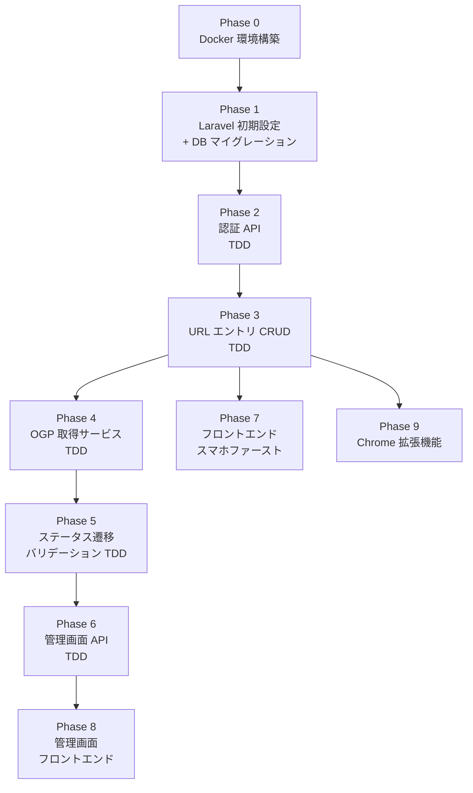
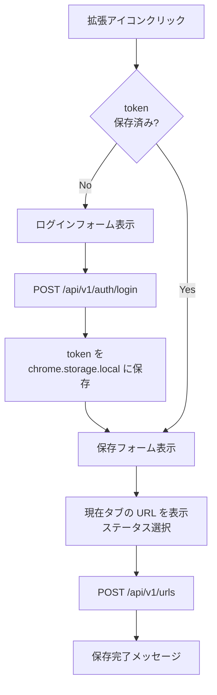

# URL共有ツール 実装プラン

## フェーズ全体図



---

## TDD の進め方

各バックエンドフェーズは **Red → Green → Refactor** サイクルで進める。

```
1. Red      テストを先に書いて失敗を確認する
2. Green    テストが通る最小限の実装をする
3. Refactor テストを壊さずコードを整理する
```

### テスト構成

```
backend/tests/
├── Feature/
│   ├── Auth/
│   │   ├── RegisterTest.php
│   │   ├── LoginTest.php
│   │   └── LogoutTest.php
│   ├── UrlEntry/
│   │   ├── ListUrlEntriesTest.php
│   │   ├── CreateUrlEntryTest.php
│   │   ├── UpdateUrlEntryStatusTest.php
│   │   └── DeleteUrlEntryTest.php
│   └── Admin/
│       ├── AdminUrlEntryTest.php
│       └── AdminUserTest.php
└── Unit/
    └── Services/
        └── OgpFetchServiceTest.php
```

### 実行コマンド

```bash
# 全テスト
docker compose exec php php artisan test

# フィルタ指定
docker compose exec php php artisan test --filter RegisterTest
docker compose exec php php artisan test --filter UrlEntry
```

---

## Phase 0: Docker 環境構築

### 目的
テストが実行できる Docker 環境を整える。

### 作成するファイル

```
docker-compose.yml
docker/
  nginx/default.conf
  php/Dockerfile          # マルチステージ（development / production）
.env.db.example
backend/.env.example
```

### 確認コマンド

```bash
docker compose up -d --build
docker compose exec php php artisan test   # デフォルト 2 テストが通ること
docker compose exec php php artisan migrate
```

### 完了条件
- `docker compose up -d` でコンテナ 3 つ（nginx / php / db）が起動する
- `php artisan test` が Green
- `http://localhost` で nginx が応答する

---

## Phase 1: Laravel 初期設定・DB マイグレーション

### 目的
Sanctum・PostgreSQL の接続設定と、全テーブルのマイグレーションを完成させる。

### 作業内容

```bash
# Sanctum インストール
docker compose exec php composer require laravel/sanctum
docker compose exec php php artisan vendor:publish \
  --provider="Laravel\Sanctum\SanctumServiceProvider"
```

### マイグレーションファイル

```
backend/database/migrations/
  xxxx_create_users_table.php        # id(UUID), email, password, is_admin
  xxxx_create_url_entries_table.php  # id(UUID), user_id(FK), url, title,
                                     # description, thumbnail_url, status
  xxxx_create_personal_access_tokens_table.php  # Sanctum 自動生成
```

### Factory / Seeder

```
backend/database/factories/
  UserFactory.php       # is_admin: false がデフォルト
  UrlEntryFactory.php   # status: 'temporary' がデフォルト
```

### 完了条件
- `php artisan migrate` が通る
- `php artisan migrate:fresh` 後に全テーブルが存在する

---

## Phase 2: 認証 API

### テストケース（先に書く）

**RegisterTest.php**
```php
test('正常なパラメータでユーザ登録できる', ...);       // 201, token を返す
test('メールアドレスが重複している場合は 422', ...);
test('パスワードが 8 文字未満の場合は 422', ...);
test('email が不正形式の場合は 422', ...);
```

**LoginTest.php**
```php
test('正しい認証情報でトークンを取得できる', ...);     // 200, token を返す
test('誤ったパスワードで 401 を返す', ...);
test('存在しない email で 401 を返す', ...);
```

**LogoutTest.php**
```php
test('ログアウト後にトークンが無効化される', ...);     // 200, 以後 401
test('未認証でログアウトすると 401', ...);
```

### 実装対象

```
app/Http/Controllers/Api/AuthController.php
  - register(Request $request)
  - login(Request $request)
  - logout(Request $request)

routes/api.php
  POST /api/v1/auth/register
  POST /api/v1/auth/login
  POST /api/v1/auth/logout   ← auth:sanctum ミドルウェア
```

### 完了条件
- `php artisan test --filter Auth` が全 Green

---

## Phase 3: URL エントリ CRUD

OGP 取得はこの段階では **null を返すスタブ** で実装し、Phase 4 で差し替える。

### テストケース（先に書く）

**ListUrlEntriesTest.php**
```php
test('認証済みユーザが自分の URL リストを取得できる', ...);  // data に自分の件数
test('他のユーザの URL は含まれない', ...);
test('status パラメータでフィルタできる', ...);             // ?status=temporary
test('未認証は 401', ...);
```

**CreateUrlEntryTest.php**
```php
test('URL を保存できる', ...);                             // 201, OGP は null 可
test('status のデフォルトは temporary', ...);
test('不正な URL フォーマットは 422', ...);
test('同じ URL の重複保存は 409', ...);
test('未認証は 401', ...);
```

**UpdateUrlEntryStatusTest.php**
```php
test('仮保存 → ブックマーク に変更できる', ...);           // 200
test('仮保存 → 削除 に変更できる', ...);                  // 200
test('ブックマーク → 削除 に変更できる', ...);             // 200
test('他のユーザの URL は変更できない', ...);              // 403
test('未認証は 401', ...);
```

**DeleteUrlEntryTest.php**
```php
test('自分の URL を論理削除できる', ...);   // status が deleted になること
test('他のユーザの URL は削除できない', ...); // 403
test('未認証は 401', ...);
```

### 実装対象

```
app/Http/Controllers/Api/UrlEntryController.php
  - index(Request $request)    GET  /api/v1/urls
  - store(Request $request)    POST /api/v1/urls
  - update(Request $request, UrlEntry $urlEntry)  PATCH /api/v1/urls/{id}
  - destroy(UrlEntry $urlEntry)                   DELETE /api/v1/urls/{id}

app/Http/Requests/
  StoreUrlEntryRequest.php    # url(required|url), status(in:temporary,bookmarked)
  UpdateUrlEntryRequest.php   # status(in:temporary,bookmarked,deleted)

app/Models/UrlEntry.php
  - $fillable, $casts
  - スコープ: scopeForUser(), scopeByStatus()

routes/api.php  ← auth:sanctum グループに追加
```

### 完了条件
- `php artisan test --filter UrlEntry` が全 Green
- Phase 2 の Auth テストも引き続き Green

---

## Phase 4: OGP 取得サービス

外部 HTTP リクエストは `Http::fake()` でモックしてテストする。

### テストケース（先に書く）

**OgpFetchServiceTest.php**
```php
test('og:title / og:description / og:image を取得できる', ...);
test('og: タグがない場合は <title> にフォールバックする', ...);
test('meta[name=description] にフォールバックする', ...);
test('タイムアウト時は null を返す', ...);
test('接続エラー時は null を返す', ...);
test('HTTP 4xx / 5xx レスポンス時は null を返す', ...);
```

### 実装対象

```
app/Services/OgpFetchService.php
  - fetch(string $url): array
      戻り値: ['title' => ?, 'description' => ?, 'thumbnail_url' => ?]
      タイムアウト: 5 秒
      失敗時: 全フィールド null

app/Http/Controllers/Api/UrlEntryController.php
  - store() 内の OGP スタブ → OgpFetchService::fetch() に差し替え
  - OgpFetchService は DI（コンストラクタ注入）
```

### 完了条件
- `php artisan test --filter OgpFetchService` が全 Green
- Phase 3 の CreateUrlEntry テストも引き続き Green（疎結合の確認）

---

## Phase 5: ステータス遷移バリデーション

### テストケース（先に書く）

**UpdateUrlEntryStatusTest.php に追加**
```php
test('削除済みの URL はいかなるステータスにも変更できない', ...);  // 422
test('存在しないステータス値は 422', ...);
test('bookmarked → temporary への逆戻りは 422', ...);
```

### 実装対象

```
app/Models/UrlEntry.php
  + const VALID_TRANSITIONS = [
      'temporary'  => ['bookmarked', 'deleted'],
      'bookmarked' => ['deleted'],
      'deleted'    => [],
    ];
  + isValidTransition(string $newStatus): bool

app/Http/Requests/UpdateUrlEntryRequest.php
  + Rule::custom で現在ステータスからの遷移チェックを追加
```

### 完了条件

| 遷移 | 期待結果 |
|---|---|
| temporary → bookmarked | 200 |
| temporary → deleted | 200 |
| bookmarked → deleted | 200 |
| bookmarked → temporary | 422 |
| deleted → any | 422 |
| any → 不正値 | 422 |

- 全パターンがテストで担保されていること

---

## Phase 6: 管理画面 API

### テストケース（先に書く）

**AdminUrlEntryTest.php**
```php
test('管理者は全ユーザの URL リストを取得できる', ...);   // 200
test('非管理者は 403', ...);
test('未認証は 401', ...);
test('管理者は任意の URL を削除できる', ...);             // 200
test('管理者はブックマーク済み URL を HTML エクスポートできる', ...);
  // Content-Type: text/html
```

**AdminUserTest.php**
```php
test('管理者はユーザ一覧を取得できる', ...);
test('管理者はユーザを作成できる', ...);
test('管理者は自分以外のユーザを削除できる', ...);
```

### 実装対象

```
app/Http/Controllers/Api/Admin/UrlEntryController.php
  - index()    GET  /api/v1/admin/urls
  - destroy()  DELETE /api/v1/admin/urls/{id}
  - export()   GET  /api/v1/admin/export/bookmarks

app/Http/Middleware/EnsureUserIsAdmin.php
  - is_admin が false なら 403 を返す

database/migrations/xxxx_add_is_admin_to_users_table.php
  - is_admin boolean NOT NULL DEFAULT false

routes/api.php
  Route::middleware(['auth:sanctum', EnsureUserIsAdmin::class])
      ->prefix('admin')
```

### 完了条件
- `php artisan test --filter Admin` が全 Green
- バックエンド全テスト Green を維持

---

## Phase 7: フロントエンド（ユーザ向け）

### 画面構成

| ファイル | 画面 | 説明 |
|---|---|---|
| `frontend/index.html` | ログイン | 未認証時のランディング |
| `frontend/list.html` | URL 一覧 | 保存済み URL の閲覧・操作 |

### 実装順序

```
1. ログイン画面
   - POST /api/v1/auth/login → token を localStorage に保存
   - 成功後 list.html へ遷移

2. URL 一覧画面
   - GET /api/v1/urls でリスト取得・カード描画
   - ステータスフィルタ（仮保存 / ブックマーク）
   - 各カード: ブックマーク化ボタン（PATCH）・削除ボタン（DELETE）

3. URL 追加
   - フローティングボタン → モーダル or インライン入力
   - POST /api/v1/urls → 成功後リストに追加

4. 共通
   - 認証チェック（token なければ index.html へリダイレクト）
   - API エラー時のトースト表示
```

### デザイン方針

```
カラー（青系モダン）
  --primary:      #2563EB
  --primary-dark: #1D4ED8
  --surface:      #F8FAFF
  --text:         #0F172A
  --text-muted:   #64748B

レイアウト
  モバイルファースト（基準幅 390px）
  カードリスト（サムネイル + タイトル + 操作ボタン）
  ボトムナビゲーション
```

### 完了条件
- スマホサイズでログイン → 保存 → 一覧 → ブックマーク化 → 削除 の一連操作が通る

---

## Phase 8: 管理画面フロントエンド

### 画面構成

| ファイル | 画面 |
|---|---|
| `admin/index.html` | ログイン |
| `admin/urls.html` | URL 一覧・削除 |
| `admin/export.html` | ブックマーク HTML エクスポート |

### デザイン方針
テーブル・フォーム中心の PC レイアウト（最小幅 1024px 想定）。

### 完了条件
- PC ブラウザで管理者ログイン → 一覧確認 → 削除 → エクスポートの操作が通る

---

## Phase 9: Chrome 拡張機能

### ファイル構成

```
extension/
  manifest.json    # Manifest V3, permissions: ["activeTab", "storage"]
  popup.html       # ログインフォーム or 保存フォームを切り替えて表示
  popup.js         # ロジック（API 通信・トークン管理）
  icons/           # 16px / 48px / 128px
```

### 動作フロー



### 完了条件
- Chrome に手動インストールして、現在のタブ URL を保存できる

---

## 進捗チェックリスト

```
[x] Phase 0: Docker 環境構築
[x] Phase 1: Laravel 初期設定・DB マイグレーション
[x] Phase 2: 認証 API
[x] Phase 3: URL エントリ CRUD
[x] Phase 4: OGP 取得サービス
[x] Phase 5: ステータス遷移バリデーション
[x] Phase 6: 管理画面 API
[x] Phase 7: フロントエンド（ユーザ向け）
[x] Phase 8: 管理画面フロントエンド
[x] Phase 9: Chrome 拡張機能
```

**バックエンド（Phase 0〜6）の鉄則：**
`php artisan test` が常時 Green を維持したまま次のフェーズに進む。
