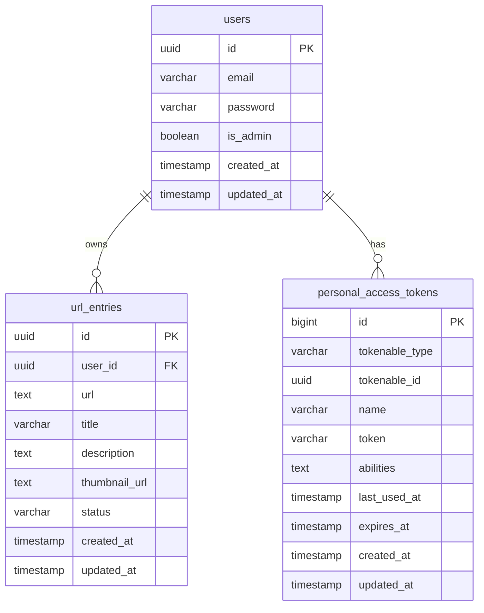

# URL共有ツール データモデル設計書

## 1. ER図



---

## 2. テーブル定義

### users

| カラム | 型 | 制約 | 説明 |
|---|---|---|---|
| id | UUID | PK | ユーザID |
| email | VARCHAR(255) | UNIQUE NOT NULL | メールアドレス（ログインID） |
| password | VARCHAR(255) | NOT NULL | パスワードハッシュ（bcrypt） |
| is_admin | BOOLEAN | NOT NULL DEFAULT false | 管理者フラグ |
| created_at | TIMESTAMPTZ | DEFAULT NOW() | 作成日時 |
| updated_at | TIMESTAMPTZ | DEFAULT NOW() | 更新日時 |

```sql
CREATE TABLE users (
    id         UUID PRIMARY KEY DEFAULT gen_random_uuid(),
    email      VARCHAR(255) UNIQUE NOT NULL,
    password   VARCHAR(255) NOT NULL,
    is_admin   BOOLEAN NOT NULL DEFAULT false,
    created_at TIMESTAMP WITH TIME ZONE DEFAULT NOW(),
    updated_at TIMESTAMP WITH TIME ZONE DEFAULT NOW()
);
```

### url_entries

| カラム | 型 | 制約 | 説明 |
|---|---|---|---|
| id | UUID | PK | エントリID |
| user_id | UUID | FK → users.id, ON DELETE CASCADE | 所有ユーザID |
| url | TEXT | NOT NULL | 保存したURL |
| title | VARCHAR(500) | NULL | OGPから取得したタイトル |
| description | TEXT | NULL | OGPから取得した概要 |
| thumbnail_url | TEXT | NULL | OGPから取得したサムネイル画像URL |
| status | VARCHAR(20) | NOT NULL DEFAULT 'temporary' | ステータス（下記参照） |
| created_at | TIMESTAMPTZ | DEFAULT NOW() | 保存日時 |
| updated_at | TIMESTAMPTZ | DEFAULT NOW() | 最終更新日時 |

**status の許容値:**

| 値 | 意味 |
|---|---|
| `temporary` | 仮保存（デフォルト） |
| `bookmarked` | ブックマーク済み |
| `deleted` | 削除済み（論理削除） |

```sql
CREATE TABLE url_entries (
    id              UUID PRIMARY KEY DEFAULT gen_random_uuid(),
    user_id         UUID NOT NULL REFERENCES users(id) ON DELETE CASCADE,
    url             TEXT NOT NULL,
    title           VARCHAR(500),
    description     TEXT,
    thumbnail_url   TEXT,
    status          VARCHAR(20) NOT NULL DEFAULT 'temporary'
                    CHECK (status IN ('temporary', 'bookmarked', 'deleted')),
    created_at      TIMESTAMP WITH TIME ZONE DEFAULT NOW(),
    updated_at      TIMESTAMP WITH TIME ZONE DEFAULT NOW()
);

CREATE INDEX idx_url_entries_user_status ON url_entries(user_id, status);
```

### personal_access_tokens

Laravel Sanctum のマイグレーションで自動生成。`tokenable_type` / `tokenable_id` で `users` テーブルとポリモーフィック関連を持つ。

---

## 3. ステータス遷移

```
[仮保存: temporary] ──→ [ブックマーク: bookmarked]
[仮保存: temporary] ──→ [削除: deleted]
[ブックマーク: bookmarked] ──→ [削除: deleted]
[削除: deleted] ──→ 変更不可
```

---

## 4. インデックス方針

| インデックス | 対象 | 理由 |
|---|---|---|
| `idx_url_entries_user_status` | `(user_id, status)` | リスト取得・フィルタリングの主要クエリをカバー |
| `users.email` | `email` (UNIQUE) | ログイン時の検索・重複チェック |
